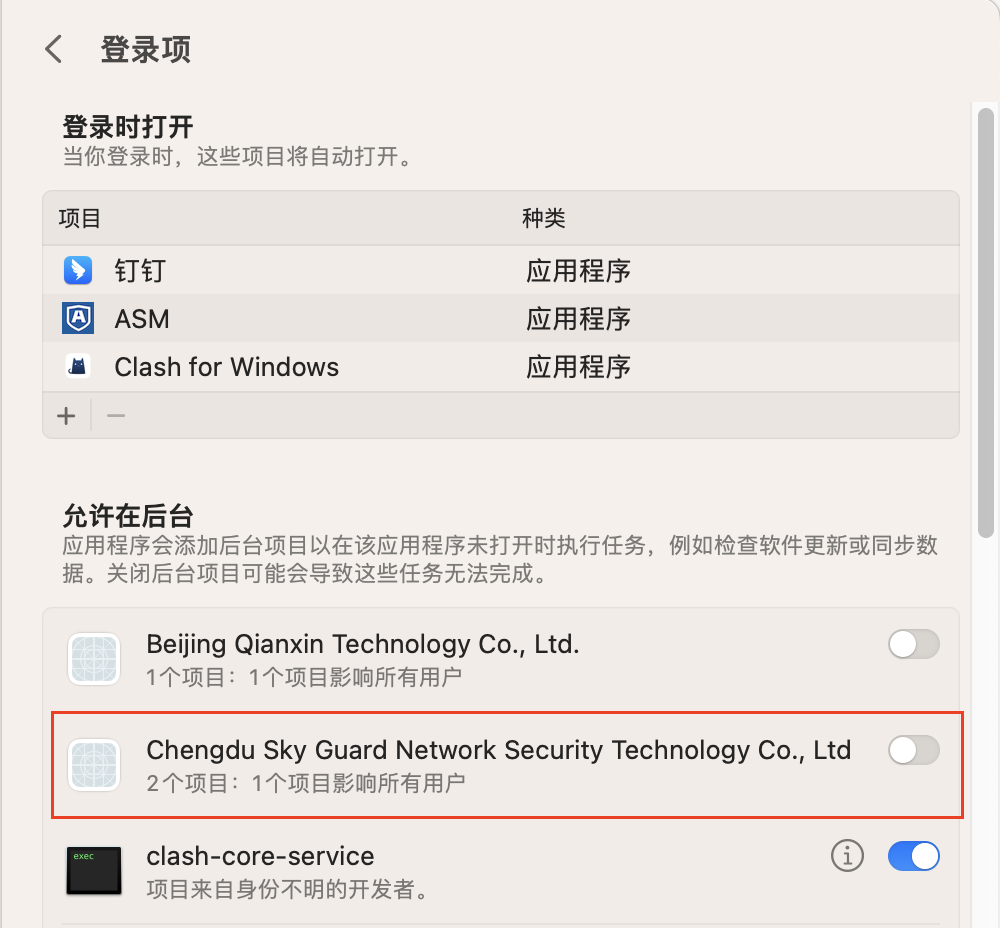
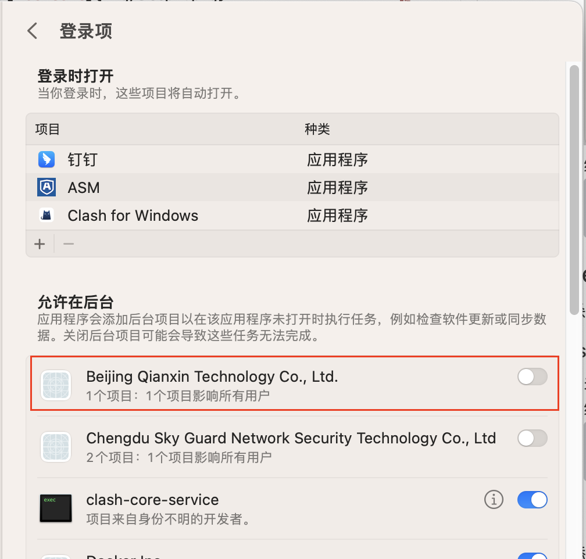

# 绕过准入软件检查

禁止软件的进程自启动，通过模拟进程来绕过检查。

## endpoint

关闭 DLP 监控，并绕过准入软件检测，保证关闭 DLP 后仍可以联网

### Steps

1. 关闭后台运行权限
   
2. 编译
   ```python
   PyInstaller EndpointWatchdog.py
   ```

## tqclient

关闭杀毒，并绕过准入软件检测。

### Steps

1. 关闭后台运行权限
  
2. 编译
   ```python
   PyInstaller tqclient.py
   ```

## Mac 自启动 

**建议将文件放到 HOME 下，放到 document 下会存在权限问题**

通过添加 plist 实现

> The plist file must be owned by root and group wheel as rw only for owner. So root:wheel 600


1. 修改 plist 中脚本路径，替换 `/Users/a1021500519/Documents/github/soul-netcheck/netcheck.sh`

2. 加载 plist

```shell
# 加载
launchctl load ~/Library/LaunchAgents/soul.netcheck.script.plist

# 卸载
launchctl unload ~/Library/LaunchAgLaunchAgents/soul.netcheck.script.plist
```

netcheck.sh 需要一直在后台运行，否则启动的 tqclient 和 EndpointWatchdog 会被杀掉
